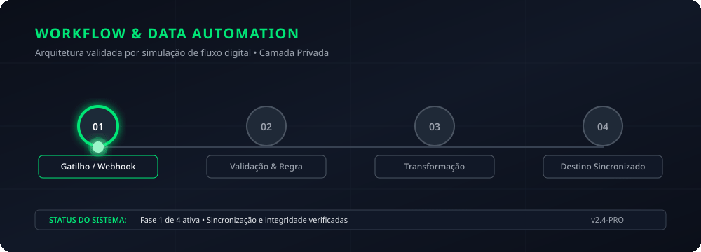
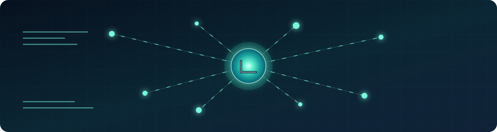

# Kawã Silva dos Santos

  

> **Estudante de Tecnólogo em Segurança da Informação** com foco em desenvolvimento seguro, automação e aplicações web.

Estou construindo uma trajetória prática em tecnologia por meio de projetos versionados, estudo contínuo e documentação clara. Meu interesse está na interseção entre **Segurança da Informação**, **Python**, automação para Linux e desenvolvimento de experiências web úteis e acessíveis.

## Em evolução

| Frente | Direção atual |
|---|---|
| Segurança da Informação | Fundamentos de desenvolvimento seguro, hardening, análise estática e práticas de segurança aplicadas a projetos próprios. |
| Desenvolvimento | Python, TypeScript, JavaScript, React, Node.js e integração de APIs. |
| Automação | Ferramentas locais para terminal Linux, organização de fluxo de trabalho e agentes assistivos. |
| Leviatã | Projeto privado de agente local para terminal, com memória, auditoria, planejamento e provedores de LLM configuráveis. |

## Projetos selecionados

| Projeto | O que representa |
|---|---|
| [Portfólio técnico](https://leviatad21.github.io/) | Espaço público para acompanhar projetos web e evolução profissional. |
| [eShark](https://github.com/LEVIATAD21/eshark) | Projeto web em JavaScript para estudo, experimentação e evolução técnica. |
| [Padaria Xodó](https://github.com/LEVIATAD21/Padaria-xod-) | Experiência digital de pedidos desenvolvida em TypeScript. |
| [Cardápio](https://github.com/LEVIATAD21/cardapio) | Projeto de cardápio digital em desenvolvimento. |
| [AI Agents Team](https://github.com/LEVIATAD21/ai-agents-team) | Experimento em Python com agentes de terminal colaborativos e orquestração de tarefas. |

## Tecnologias em estudo e prática

`Python` · `TypeScript` · `JavaScript` · `React` · `Node.js` · `PostgreSQL` · `Git` · `Linux` · `APIs` · `Segurança de aplicações`

## Princípios de trabalho

Construo de forma incremental, mantendo o que é verificável: requisitos claros, código legível, testes quando aplicáveis, atenção a segurança e interfaces que respeitem acessibilidade, desempenho e contexto de uso.

## Contato profissional

Estou aberto a oportunidades de estágio, posições júnior e projetos compatíveis com meu momento de formação em tecnologia e Segurança da Informação.

  Perfil mantido com foco em projetos reais, aprendizado contínuo e evolução responsável.

