# Kawã Silva dos Santos

**Estudante de Tecnólogo em Segurança da Informação** · Python · Automação · Desenvolvimento Web

Estou construindo uma trajetória prática em tecnologia, com interesse em segurança da informação, desenvolvimento de aplicações web e automação. Atualmente, curso Tecnólogo em Segurança da Informação e busco oportunidades de estágio ou posições júnior nas quais eu possa aprender, contribuir e evoluir com responsabilidade.

## Áreas de interesse

- Segurança da Informação e boas práticas de desenvolvimento seguro.
- Python, automação e ferramentas para terminal Linux.
- Desenvolvimento web com TypeScript, React e Next.js.
- APIs, bancos de dados relacionais e integração de serviços.

## Projetos selecionados

| Projeto | Descrição |
|---|---|
| [AI Agents Team](https://github.com/LEVIATAD21/ai-agents-team) | Experimento de agentes de terminal colaborativos e coordenação entre componentes de IA. |
| [KAWA-AI](https://github.com/LEVIATAD21/manus-clone-ai) | Projeto privado de agente modular para terminal, com suporte a provedores de LLM configuráveis. |
| [Portfólio](https://github.com/LEVIATAD21/LEVIATAD21.github.io) | Repositório do portfólio e dos projetos web em desenvolvimento. |
| [eShark](https://github.com/LEVIATAD21/eshark) | Projeto web em JavaScript disponível para estudo e evolução. |

## Tecnologias em estudo e prática

`Python` · `TypeScript` · `JavaScript` · `React` · `Next.js` · `Node.js` · `PostgreSQL` · `Git` · `Linux`

## Contato profissional

Estou aberto a oportunidades de aprendizado, colaboração e projetos compatíveis com meu nível atual de formação.

> Este perfil é mantido com foco em projetos reais, aprendizado contínuo e documentação clara.
